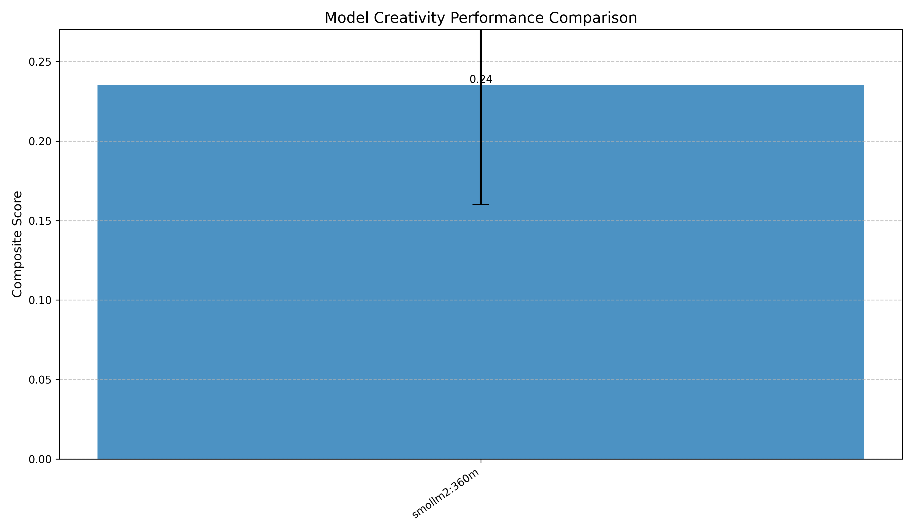

# LLM Creativity Benchmark
A comprehensive evaluation suite for measuring creative capabilities in large language models (LLMs). This benchmark assesses multiple key dimensions of creativity through structured tests and quantitative metrics.

Based on [this](https://gwern.net/creative-benchmark) post by Gwern.



## Key Features
- **Free Association Test**: Measures lexical originality and vocabulary estimation
- **Telephone Game**: Quantifies semantic drift through iterative paraphrasing
- **Camel's Back Challenge**: Tests narrative coherence under multiple edits
- **DRY (Don't Repeat Yourself) Test**: Evaluates output diversity across prompts
- **Extreme Style Transfer Test**: Take a set of stories with genre labels; ask a LLM to summarize each one; then ask it to write a story using only the summary and a random other genre label; score based on how different the other genre versions are from the original. 
- **Composite Creativity Score**: Combined metric aggregating multiple dimensions

Supports `ollama` for local generation as well as the OpenAI API (URL is set to huggingface).

`config.py` has some stories and genre labels for extreme generation but these are very basic and can be improved.

I have only run the model on a few small models as it takes a bit to run and I am GPU poor :(

## Installation and Usage

Clone the repository and run:

```
pip install -r requirements.txt
```

Set HF_TOKEN to your huggingface token as an environment variable and run `cli.py`:

```
usage: cli.py [-h] [--model MODEL] [--prompt PROMPT] [--save] [--use_api] [--n N]

Run the LLM Creativity Benchmark and output the results.

options:
  -h, --help       show this help message and exit
  --model MODEL    Name of the model to benchmark.
  --save           Save results as JSON file in 'runs' directory
  --use_api        Use Hugging Face API for generation
  --n N            Number of benchmark runs
```

To visualize the results of all evaluation runs:

```
python visualize_results.py
```

## Contributing

Please feel free to contribute by submitting pull requests or issues. I am hoping to implement all of the benchmarks mentioned by Gwern's post. We welcome any feedback on how we can improve the benchmark suite.

Also if anyone would like to run the benchmark on different models and submit that results, please do so!

## License

MIT